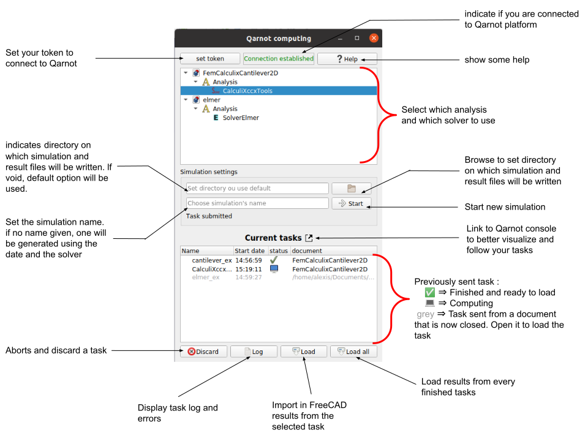

## Purpose

The purpose of this FreeCAD macro is to provide a simple GUI interface to send FEM computing task from the FEM workbench to Qarnot's cloud computing platform.
The code can also be used in a non-gui environment by using python class QarnotController.


## Available version

The macro works with FreeCAD 0.19. It *doesn't work* with previous versions and has not been tested with newer ones.
The macro currently supports the following solvers :
- CcxTools and Ccx
- Elmer
- z88


## Content

The code contains four main files:
- `gui.py` contains the class representing the window that is opened by the macro.
- `controller.py` mainly contains the class `QarnotController`. This class is used to start tasks, load their results and manage them. It also has an `event_delegate` attribute that inherits from `ControllerEventDelegate` that can be specified to automatically handle events such as when a task is submitted or has finished.
- `femtasks.py` contains the class `QarnotFemTask` which takes a FEM solver from FreeCAD and creates the appropriate task on Qarnot platform. It can be extended to support new types of solver. The second class in the module, `QarnotOldFemTask` represents a task that was sent on a previous session and that the macro is trying to pull back in FreeCAD. To do so, it uses the flags sent with the task and checks if the document and objects used to send the task are present in the current FreeCAD session.
- `FemCloudComputingQarnot.FCmacro` is the macro that can be run in FreeCAD. It only creates a window from the `gui.py` module

Other less important files are :
- `femenums.py` contains enumerations used by `QarnotFemTask`. One represents a task state and the second represents a solver type (CalculiX, Elmer, ...)
- `Gui/eventhandler.py` contains the event handler used by the Gui to handle events and callbacks sent by the `QarnotController`. It essentially periodically calls every tasks' `wait_callback` method which actualizes the task state.
- `Gui/utils.py` consists in a few utility functions used by `gui.py`, such as inserting items in the window's widgets or listing all available solvers.
- `Gui/widgets.py` defines some specific simple widgets that are used by `gui.py`
- `Gui/Resources.py` contains some resources (text, images) used by the `gui.py`


## Installation

You can find the step by step explanation for installation in [Qarnot's documentation](). Here is a quick overview:


## How to run with GUI

You can find the step by step explanation for installation and running in [Qarnot's documentation](). Here is a quick overview:


## How to run without GUI

The macro can also be used directly in Python by using the non-gui objects directly. Before using the macro, you should first get used to creating and starting FEM in FreeCAD using python. You can learn with [this tutorial](https://wiki.freecadweb.org/FEM_Tutorial_Python).
The workflow to send a task to Qarnot is to create a `QarnotController` object, establish connection with your Qarnot token, and use its `start_fem(solver, name, working_dir)` method (`working_dir` is optional) . Next, you'll have to wait for the task to finish. The best way to do it is by subclassing `ControllerEventDelegate` and provide an instance in the `QarnotController` constructor. Finally, use `QarnotController.load_result` to load in FreeCAD the results
A simple example is provided below :
- Open the **CCX cantilever face load** document from **Utilities → Open FEM examples** (after selecting the FEM Workbench). You can open the example from any of the supported solver.
- Run the following script after **filling in** the appropriate *token*, *import path*, *document name* and *solver name*. If you don't know how to do this, the simplest way is as follow :
  - Click on the  **execute macro** button  and click the create button.
  - Copy the script bellow and save (Ctrl+S)
  - Click on the  **Start macro** button to execute the python script.
- Once the script is finished, *task example finished* will prompt and name of newly created objects will be printed.

```python
import FreeCAD as App
from PySide.QtCore import Slot, QTimer
import sys
sys.path.insert(1, '***Path to the directory in which you downloaded the macro***')
import femtask
import controller


# Class used to manage events sent by the controller when a task is submitted or finished
# Also calls every second, actualize_tasks to get new task state.
class EventHandler(controller.ControllerEventDelegate):
    def __init__(self) -> None:
        super().__init__()
        self.timer = QtCore.QTimer(self)
        self.timer.timeout.connect(self.actualize_tasks)
        self.timer_interval = 1000
    
    def on_task_finished(self, uuid: str):
        print(f'task {self.controller.tasks[uuid].name} finished')
        self.controller.load_result(uuid)

    def on_task_submitted(self, uuid):
        print(f'task {self.controller.tasks[uuid].name} submitted')

    def on_task_loaded(self, uuid):
	 # load results and print name of newly created objects
        print(f'new result objects : {self.controller.tasks[uuid].result_object_names}')
    
    @QtCore.Slot()
    def actualize_tasks(self):
        self.controller.actualize_tasks()
    

#Create a controller and establish the connection
cont = controller.QarnotController(EventHandler())
cont.establish_connection("****Your token****")

# Retrieve solver and start fem task with this solver
solver = App.getDocument("***Document name (e.g Unnamed)***").getObject("***Solver Name (SolverCalculiX or SolverElmer or SolverZ88)***")
cont.start_fem(solver, "example", "./fem_working_dir" )

# Start the callback
cont.event_delegate.timer.start()

```


## Macro overview

### Run the simulation

To run a simulation, run the macro and fill in your Qarnot token (which can be found [here](https://account.qarnot.com/compute)) by clicking the *set token* button. 
Select the desired solver object and click start. The running task will be shown below. Once finished, select the task and click load to import the results in FreeCAD.

<p>
    
</p>


### Macro parameter

The macro lets you set two parameters before starting a simulation :
- The working directory can be set, just like when starting a simulation using the standard way. This directory will be used to write the simulation files and results will be loaded there. If no directory is set, a default will be used, according to your FreeCAD settings (if you didn't change them, a temporary directory is used)
- The simulation name, which will make it easier to handle your simulations when you send several ones. The result objects will have this name.


### Macro operation

The way the macro is working is the following :
- When start_fem is called, the macro uses the standard FreeCAD code from `femsolver` to write the simulation file on disk
- Then, the macro creates a `qarnot.task` with the appropriate parameters and a bucket containing the working directory. The task is then submitted
- The `event_delegate` is responsible to call periodically each task `wait_callback` method which actualizes the task's state. If a task finishes, it automatically loads the result files onto the working directory.
- The user can then click on the *load* button or call `QarnotController.load_result` to import the result in FreeCAD. When the objects are created, their names are changed to represent the simulation name. This makes it easier to handle results when many simulations are sent at the same time.

This functioning has a few implications :
- The meshing and file writing are done on the computer even though they can be a bit long. Regarding meshing, it is so because it usually needs some trials and errors to get a good mesh, and such process would be long using Qarnot platform because of the delay between a task submit and its actual execution. File writing could be done on Qarnot's side, but it would require much more complicated docker files and mechanisms.
- It is needed to manually load results. Since importing results can be long, manually loading result prevents from unwanted freezes in FreeCAD execution.
- One big advantage of using the cloud is to perform several simulations at the same time. This is why new results never overwrite previous ones.

To retrieve simulations sent during another use of the macro, the macro uses the tag mechanism. Each simulation is sent with the *FreeCAD macro* tag along with useful constants : *FREECAD_WORKING_DIR*, *FREECAD_DOCUMENT*, *FREECAD_SOLVER*. Some other solver specific constants may be added (for example with ccxTools). Thanks to these constants it can find back the solver and the working directory used to start the simulation.